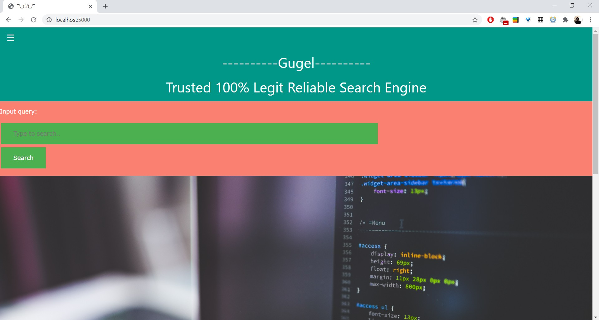

# Tugas Besar Algeo 02
> Mesin pencari sederhana dengan memanfaatkan aplikasi dot product pada sistem temu-balik informasi

## General Info
Program search engine sederhana ini menggunakan konsep temu-balik informasi dengan model ruang vektor dan menggunakan cosine similarity untuk mencari relevansi antara dokumen dengan search query yang ada. Temu-balik informasi sendiri singkatnya adalah sistem yang bekerja untuk mencari informasi yang relevan (dokumen) dengan yang diinginkan pengguna (search query) dari kumpulan-kumpulan informasi secara otomatis. Secara lebih detail bagaimana cara kerja sistem temu-balik informasi dengan model ruang vektor sebagai berikut : Misalkan sudah ada kumpulan dokumen pada search engine kami, kemudian dari kumpulan dokumen tersebut kami proses sehingga mendapatkan sejumlah term atau kata. Proses yang dilakukan adalah menyederhanakan kata-kata yang ada pada dokumen menjadi kata dasar, menghilangkan tanda baca dan pungtuasi sehingga term atau kata yang ada menjadi bermakna umum. Setelah mendapatkan kumpulan term, seluruh dokumen dan search query dinyatakan sebagai vektor. Contoh vektor w = (w1,w2,...,wn) dalam Rn dengan wi adalah bobot setiap kata atau term yang ada dalam query atau dokumen. Setelah terbentuk vektor-vektor, untuk mendapatkan relevansi antara query dengan dokumen-dokumen yang ada, dapat dilakukan dengan cara menghitung cosine similarity. Cosine similarity ini merupakan perkalian dot 2 buah vektor, tetapi yang kita cari adalah cos teta nya. Karena di awal kita ingin mencari dokumen yg paling relevan dengan query, maka kita bandingkan cosine similarity antara seluruh dokumen dengan query. Jika hasil cosine similarity tinggi (mendekati satu) maka semakin tinggi pula relevansi antara dokumen dengan query.

## Screenshots

## How To Use
Sebelumnya, pastikan sudah meng-install library yang dibutuhkan, diantaranya flask, nltk, pandas, BeautifulSoup, dan requests.

Penggunaan Program:

1. Buka terminal (cmd) pastikan berada di directory di mana file berada.

2. Masuk ke directory venv/Scripts lalu tulis activate di terminal untuk mengaktifkan virtual environtment.

3. Kembali ke directory di mana file berada.

4. Jalankan app.py dengan menulis app.py di terminal.

5. Buka http://localhost:5000/ di browser Anda.

Penggunaan Search Engine:

1. Terdapat menu sidebar di pojok kiri atas, jika menekan tombol tersebut, akan ditampilkan menu untuk menuju laman web kami yang lain. Laman web kami terdapat tiga yaitu Home, Input document, dan About. Anda tinggal memilih ingin menuju laman yang mana dengan cara menekan pilihan yang sesuai dengan nama laman yang ingin Anda tuju.

2. Ketika di laman upload, jika Anda ingin mengupload file dokumen Anda, Anda tinggal menekan tombol pilih file untuk memilih file Anda, kemudian jika sudah terpilih tekan submit dan file Anda sudah terupload. Catatan: file yang bisa diterima oleh uploader hanya yang berekstensi .html dan .txt.

3. Ketika di laman home, Anda tinggal menginput query yang anda inginkan, kemudian tekan tombol search dan Anda akan mendapatkan referensi dokumen yang sudah terurut berdasarkan tingkat kemiripannya dengan query Anda.

4. Ketika Anda di laman About, Anda akan mendapati laman yang berisikan tentang latar belakang gugel dibuat, siapa saja dalang dibalik pembuatan gugel, dan ucapan terima kasih.

## About Us
Project pembuatan search engine sederhana ini berawal dari tugas besar mata kuliah Aljabar Linier dan Geometri Teknik Informatika ITB. Kami memberi nama search engine sederhana kami dengan nama gugel. Tidak ada filosofi apapun, murni hanya pelesetan dari search engine ternama di dunia, yaitu mozila firefox.

test

Kemudian dalang dibalik search engine sederhana "gugel" ini ada 3 mahasiswa yang baru saja merasakan rasanya jurusan.

Dalang yang pertama adalah $Muhammad Fawwaz Naabigh$ (13519206) ig : @fwznbg

Dalang yang kedua adalah $Nizamixavier Rafif Lutvie$ (13519085) ig : @nizamixavier

Dalang yang ketiga adalah $Dwianditya Hanif$ (13519046) ig : @nypnop

test

Tak lupa kami mengucapkan terimakasih kepada Tuhan Yang Maha Esa dan dosen pengampu Aljabar Linier dan Geometri bapak Rinaldi Munir. Dan tentunya kakak asisten yang tercinta <3.

